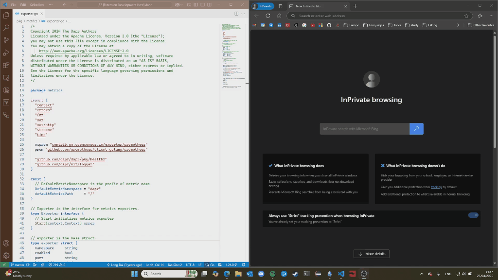

# GitLink

GitLink is a VS Code extension that generates direct links to GitHub or GitLab repositories at the current cursor position. With a single command, you can create a shareable URL that opens directly to the specific line of code in your browser.

## Features

- Generate links to specific lines of code in GitHub and GitLab repositories
- Works with the current cursor position or selected text
- Automatically detects the remote repository type (GitHub/GitLab)
- Copies the generated link directly to your clipboard
- Supports both public and private repositories (when authenticated)

## Usage

1. Place your cursor on the line you want to link to
2. Open the Command Palette (Ctrl+Shift+P)
3. Type "GitLink: Generate Link" and select the command
4. The link is copied to your clipboard and ready to share

Perfect for code reviews, documentation, and sharing specific code snippets with your team!

